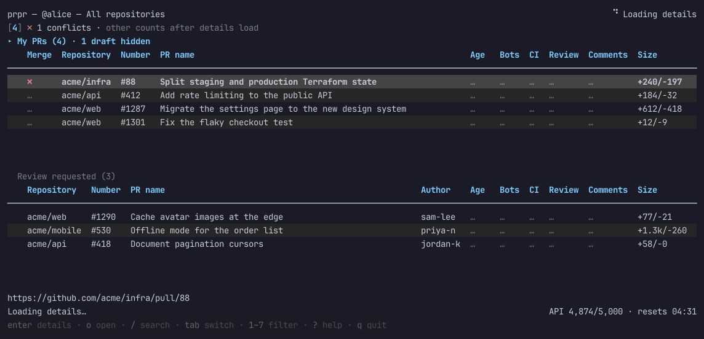
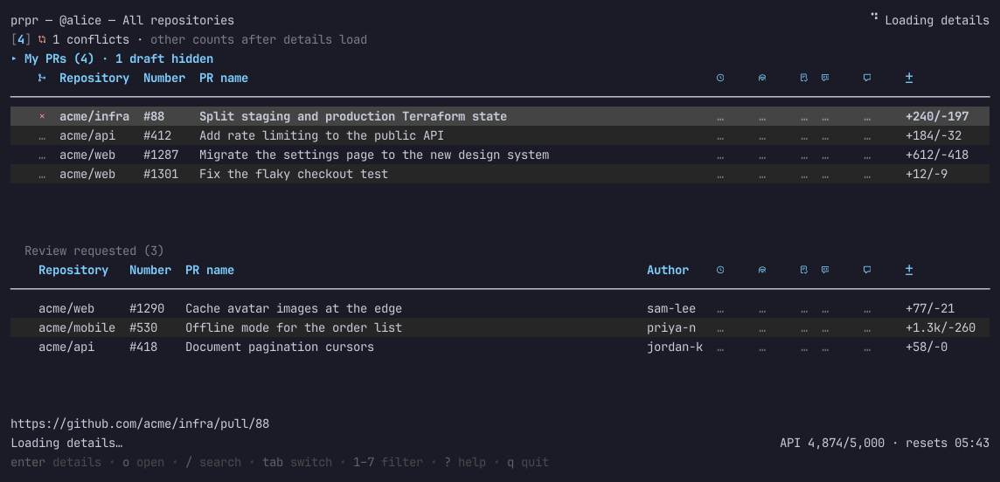

# prpr

`prpr` is a terminal app for monitoring open pull requests authored by a GitHub CLI account: gh's active account, or one you pin in prpr (see [GitHub accounts](#github-accounts)). It hides drafts until you press `D` and pulls across repositories visible to that account, and lists open pull requests that request a review from you directly in a second pane; requests to your teams, such as code-owner teams, are left out.



## Requirements

- GitHub CLI (`gh`) on `PATH`, authenticated to `github.com`. Homebrew and Scoop install it for you.
- Go 1.26 or later, only to install with `go install` or build from source. Packages and prebuilt binaries need no Go.

The app uses GitHub CLI's existing credentials and does not store tokens itself. GitHub CLI manages credential storage and may use its own plaintext fallback when no operating-system credential store is available. To connect or change accounts, use `l` from the app's authentication/error screen, or run:

```sh
gh auth login --hostname github.com --web
```

Complete the displayed device-code flow in a browser if GitHub CLI cannot open one.

## Install

### Homebrew (macOS and Linux)

```sh
brew install DragosMocrii/tap/prpr
```

### Scoop (Windows)

```powershell
scoop bucket add dragosmocrii https://github.com/DragosMocrii/homebrew-tap
scoop install prpr
```

Upgrade with `brew upgrade prpr` or `scoop update prpr`. `prpr --version` prints the installed version.

### Prebuilt binaries

Each [release](https://github.com/DragosMocrii/prpr/releases) has prebuilt archives for Linux, macOS, and Windows on amd64 and arm64, plus `checksums.txt`. Unpack the archive for your platform and put `prpr` (`prpr.exe` on Windows) on `PATH`. Run `uname -m` on macOS or Linux to choose: `arm64`/`aarch64` is arm64, and `x86_64` is amd64.

The macOS binaries are not signed or notarized, so macOS blocks a downloaded binary on first run; Homebrew installs are not affected. After checking the archive against `checksums.txt`, clear the quarantine flag:

```sh
xattr -d com.apple.quarantine prpr
```

### Install with Go

With Go 1.26 or later:

```sh
go install github.com/DragosMocrii/prpr/cmd/prpr@latest
```

Ensure Go's bin directory is on `PATH`, then run:

```sh
prpr
```

### Run from source

With Go 1.26 or later:

```sh
git clone https://github.com/DragosMocrii/prpr.git
cd prpr
go run ./cmd/prpr
```

Build a binary or install the checkout into Go's bin directory with:

```sh
go build -o /tmp/prpr ./cmd/prpr
go install ./cmd/prpr
```

## Configuration

All lists refresh automatically 5 minutes after each fetch finishes. Change the interval with `--refresh`, which takes a Go duration of at least `30s`, or turn it off with `0`:

```sh
prpr --refresh 10m
prpr --refresh 0
```

The title's top-right corner counts down to the next refresh. A manual refresh restarts the timer. GitHub computes merge states in the background and reports them as not yet computed (`?`) until it is done, so while a pull request in the repository filter shows `?`, the next refresh comes sooner: after 15 seconds, then 30, 60, and so on, up to the interval. Auto-refresh waits while the repository picker, the first-run repository prompt, or GitHub login is open, and retries failed fetches except authentication failures, which need `l`.

The status line shows the remaining GitHub GraphQL quota and its reset time (for example `API 4,981/5,000 · resets 06:14`), read every 10 seconds with a GraphQL query for the rate limit alone, which GitHub does not count against the quota. The quota is shared by everything using your GitHub account. It turns yellow below 20% and red below 5%, is marked `?` when the latest read failed. On narrow terminals the selected pull request's status drops its last facts first (see [Selected pull request](#selected-pull-request)), then the reset time, then the quota shortens to bare numbers and finally hides.

### Active hours

Press `S` to save a weekly active-hours schedule in local time. Choose the weekdays, start, and end; an end earlier than the start continues overnight into the next day. The default schedule is disabled, so existing automatic polling is unchanged until you enable one.

Outside the saved hours, prpr pauses automatic pull-request and quota requests, notifications, and automatic retries. The last successful lists stay visible and are labeled as an old snapshot; a failed one-shot refresh leaves them on screen and shows the error. At the next scheduled opening, prpr fetches both lists together and groups any accumulated alerts as usual. The quota line is labeled paused and shows when it was last read.

While asleep, `r` makes one quiet refresh: it does not notify, poll quota, or restart an automatic timer. `w` wakes for one hour; press `w` again to return to the schedule. If that hour ends inside active hours, normal polling continues until the scheduled close. An unreadable or invalid saved schedule pauses polling until repaired with `S`; `w` remains available for a one-hour manual wake.

The **Bots** column reports automated review bots. By default it covers GitHub Copilot code review, OpenAI Codex, and Claude; `--bots` replaces that list with comma-separated `Name=login` entries, each optionally followed by `:check`, a substring of the bot's check-run names. An empty value hides the column and skips the extra GitHub fields:

```sh
prpr --bots 'Copilot=copilot-pull-request-reviewer:copilot-pull-request-reviewer,Codex=chatgpt-codex-connector,Claude=claude:Claude Code Review'
prpr --bots 'Rabbit=coderabbitai'
prpr --bots ''
```

`--queues` chooses the merge queues to read, `trunk` and `github` by default; see [Merge queue](#merge-queue).

`--notify` starts with desktop notifications on; see [Notifications](#notifications). `--icons nerd` draws Nerd Font icons; see [Icons](#icons). `--title=false` leaves the terminal title alone; see [Terminal title](#terminal-title).

Bot reporting costs more GraphQL quota, mostly to read review threads: about 28 points per 100 pull requests listed, against about 3 without bots.

Preferences are stored at `prpr/preferences.json` under the directory returned by Go's `os.UserConfigDir()`. On Linux, this is `$XDG_CONFIG_HOME` when it is absolute, or `$HOME/.config` otherwise. The file stores a repository, organization, or watchlist choice and the watchlists of each GitHub account, the login of a pinned GitHub CLI account, the icon set chosen with `i`, whether the `L` legend is open, whether `D` shows drafts, the ready-to-merge rules, the snoozed pull requests of each account and the 🙏 each one dismissed with `X`, and the active-hours schedule saved with `S`; it does not contain GitHub credentials. A new account prompts for a choice. Choosing All repositories is saved as an explicit choice. Earlier versions read a saved organization choice as no choice and prompt again. Accounts without watchlists keep the format earlier versions read; once an account saves a watchlist, an account is pinned, `i` saves an icon choice, `L` saves the legend, `D` saves the drafts choice, `z` saves a snooze, `X` dismisses a 🙏, `,` saves rules, or `S` saves a schedule, prpr 0.1.16 and older refuse to open the file until it is repaired, 0.1.17 drops the pinned account and icon choice the next time it saves, 0.1.18 and 0.1.19 drop the icon choice, 0.1.22 and older drop the ready-to-merge rules, 0.1.23 and older drop the legend choice, 0.1.24 and older drop the drafts choice, 0.1.28 and older drop the snoozes, 0.1.30 and older drop the active-hours schedule, and 0.1.32 and older drop the dismissed 🙏. Rules prpr cannot read, such as a misspelled condition, are kept in the file as written while prpr uses the defaults and says so, until you save rules with `,`.

If startup reports invalid preferences, back up, repair, or remove only the reported `prpr/preferences.json` file before retrying. Do not remove GitHub CLI credentials to repair app preferences.

## Controls

- `j` / Down: select the next pull request.
- `k` / Up: select the previous pull request.
- `f` / `b` / Page Down / Page Up / Space: move by a page; `d` / `u`: move by half a page; `g` / `G` / Home / End: jump to the first or last pull request.
- Left / Right: jump to the previous or next page shown in the page indicator.
- Tab / Shift+Tab: switch between **My PRs**, **Merge queue** (while it has rows), **Review requested**, and **Snoozed** (while it has rows). Each list keeps its own selection and scroll position; navigation keys move only the focused list.
- `z`: snooze the selected pull request, or wake it when it is in **Snoozed**; see [Snoozing](#snoozing).
- `U`: undo the last snooze.
- `R`: request reviews of your selected pull request again; see [Requesting reviews again](#requesting-reviews-again).
- `X`: dismiss the blinking 🙏 on the selected review request; see [Asked again](#asked-again).
- `/`: search every list; see [Search and quick filters](#search-and-quick-filters).
- `D`: show or hide draft pull requests in every list, and save the choice; see [Drafts](#drafts).
- `F` / `M`: show only PRs with failing CI, or PRs ready to merge; press again to show all.
- `1`–`7`: show one attention category from the summary line; press again to show all. See [Attention summary](#attention-summary).
- Esc: clear the search, quick filter, and attention category.
- Enter: show the selected pull request's details; Esc or Enter goes back. See [Details](#details).
- `?`: show every key in a panel over the list, grouped by what it does; keys that do nothing on the selected row are drawn faint. `j`/`k` scroll it, and `?` or Esc closes it. The line at the bottom shows the keys you need most, led by any that apply only now, such as Esc while a filter is on.
- `p`: find and select a repository, an organization (`owner/*`, every repository it owns), or a watchlist to filter every list; choose `All repositories` to clear the filter. See [Watchlists](#watchlists).
- `c`: clear the repository filter and show all authored open PRs and review requests.
- In the repository picker, type to search (Left/Right move within the query), Enter to apply, Esc to cancel, Ctrl+U to clear, and Ctrl+R to reload accessible repositories. Each owner of the listed repositories appears as `owner/*` with its repository count, so typing `acme` finds `acme/*`. Enter `owner/repo` to check a repository outside the browsed list. Space marks repositories for a watchlist, and Ctrl+E and Ctrl+D edit and delete the watchlist under the cursor.
- `r`: refresh once without notifications or quota polling while asleep; otherwise refresh as the pinned GitHub CLI account, or gh's active one, and restart the auto-refresh timer.
- `S`: set or edit the saved weekly active-hours schedule; see [Active hours](#active-hours).
- `w`: wake for one hour, or return to the saved schedule early.
- `a`: choose the GitHub CLI account prpr uses; see [GitHub accounts](#github-accounts).
- `o`: open the selected pull request in the browser. GitHub CLI picks the browser: its `browser` setting, `GH_BROWSER`, or `BROWSER`, else the system default. With an account pinned, prpr opens the URL itself in the same order, so the browser never receives the account's token.
- `y`: copy the selected pull request's URL to the clipboard. The copy is sent as an OSC 52 terminal sequence, so it also works over SSH and in containers, but terminals without OSC 52 support, such as macOS Terminal, ignore it; copy the URL shown below the table instead.
- `x`: clear every change mark and drop gone rows (shown only while there are marks).
- `m`: turn mouse mode on or off; see [Mouse](#mouse).
- `n`: turn notifications on or off; see [Notifications](#notifications).
- `i`: switch between Unicode and Nerd Font icons, and save the choice; see [Icons](#icons).
- `L`: show or hide the icon legend under the lists, and save the choice; see [Icons](#icons).
- `,`: edit what ready to merge means, for every repository or one owner's; see [Ready-to-merge rules](#ready-to-merge-rules).
- `l`: start GitHub CLI login from an error screen.
- `q` / Ctrl+C: quit.

Repository filtering applies to every list, which come from two queries: the active account's authored open pull requests, and open pull requests requesting the account's review (`user-review-requested:@me`, which excludes requests to the account's teams). **My PRs** lists pull requests ready to merge (the green `✓`, by your [rules](#ready-to-merge-rules)) first, then the oldest created first; **Review requested** keeps the most recently updated first, with pull requests you already reviewed after them (see [After your review](#after-your-review)). All hide drafts unless `D` shows them (see [Drafts](#drafts)). The picker browses repositories associated with the account and repositories in the current PR list; a valid `owner/repo` lookup checks other repositories through GitHub. A repository with no matching pull requests in any list remains selectable and shows empty scoped lists. Repository and All selections are saved separately for each GitHub account.

Drafts are tagged `draft` before their name. The first column of **My PRs** shows whether GitHub would allow a merge now, branch protection included: `✓` ready (optional checks may still be failing), `●` blocked by required reviews or checks, `↓` behind the base branch, `✗` conflicts, `–` draft, and `?` not yet computed. With [ready-to-merge rules](#ready-to-merge-rules) of your own, `✓` is green only when they hold, and yellow when GitHub would merge but your rules say not yet. The review list shows the PR author, after the name, instead of merge status. Repository and Author columns are as wide as their longest name, up to a limit.

**My PRs** and **Review requested** also show statistics columns, which narrow terminals drop in this order: Size, Comments, Review, CI, Bots, Age. **Review requested** drops Review first, since a pending request mostly shows it as required.

- **Age**: how long the PR has waited. In **My PRs** it counts from when the PR was last marked ready for review, or from when it was opened if it was never a draft; drafts show `—`. In **Review requested** it counts from the latest review request naming you directly, and falls back to the ready-for-review time when that request is not found; for a pull request you already reviewed, it counts from your latest review or comment, or from the change that needs you again. Ages are computed when the lists load, refresh, resize, or change scope, so between refreshes they show the age as of the last update.
- **CI**: the head commit's check rollup — passing, failing, pending, or `–` when there are no checks.
- **Review**: the review decision (approved, changes requested, review required, or `–` when none applies) followed by the number of current approvals.
- **Comments**: the number of conversation comments, bots included. Code review comments are not counted.
- **Size**: lines added and removed.
- **Bots**: the most pressing state among the configured review bots. The same rule applies to every bot; severity is not read.
  - `✗n`: n review threads the bots started are unresolved and not outdated.
  - `!`: a bot's check run failed on the head commit, for example when Copilot is out of quota.
  - `◌`: a bot's check run is queued or running on the head commit.
  - `✓*`: no open threads, but a bot last acted before the head commit.
  - `✓`: no open threads, and the bots acted since the head commit with a review, a comment or comment edit, or a reaction other than 👀 on the pull request.
  - `–`: no bot has acted on the pull request.

  The line under the table lists each bot's state for the selected pull request when it fits beside the URL. Findings a bot writes only in a summary comment are not counted, and only the 20 most recent review threads are read. The head commit is dated by when it was committed, not pushed, so a commit pushed long after it was made can leave an earlier bot review showing `✓` instead of `✓*`.

### Attention summary

The line under the title counts pull requests by status, each with the number key that shows them:

```text
[1] ✓ 2 ready to merge · [2] ✗ 1 changes requested · [3] ✗ 1 failing CI · [4] ✗ 1 conflicts · [5] ✗ 3 bot threads · [6] ● 3 awaiting your review · [7] ? 1 status unknown
```

1–5 cover **My PRs**: ready to merge (the green `✓`, by your [rules](#ready-to-merge-rules)), changes requested, failing checks, conflicts, and unresolved bot threads. 6 counts review requests and reviewed pull requests that need you again, but not those waiting on others, and 7 counts pull requests in either list whose merge status GitHub has not computed yet. Unknown is its own category; it is never counted as ready or healthy, and null review decisions or check results are never counted as changes requested or failing. Categories with no pull requests are left out, and the numbers never change. There is no priority score.

Pressing a number shows only that category, focuses its list, and highlights it in the summary; pressing it again or Esc shows everything. It replaces the `F`/`M` quick filter and combines with search and the repository filter. Counts follow the repository filter and hidden drafts but not the search or quick filter, and leave out gone rows. While the quick first look is loading, only conflicts are counted. Narrow terminals shorten the labels, longest first, then show only each key, icon, and count (`[1] ✓2`), and terminals under 14 lines drop the summary.

### Search and quick filters

`/` opens a search line in place of the status line. All lists narrow as you type to pull requests whose title, repository, author, or `#number` contains every word typed, ignoring case: `412` and `#41` both find #412. Enter keeps the search and returns to the list; Esc while typing restores the previous search.

The quick filters show only pull requests whose checks failed (`F`), or pull requests ready to merge (`M`: in **My PRs** the same rule as the green `✓`; in **Review requested**, which does not read the fields rules use, whether GitHub would merge it). One is active at a time; pressing its key again turns it off. While the quick first look is loading, CI and merge states are unknown, so `F` and `M` match nothing until the details arrive.

### Drafts

All lists hide draft pull requests, including reviewed ones turned back into drafts; closed pull requests are never fetched. A list's title says how many drafts it hides, as in `My PRs (4) · 1 draft hidden`. A list with only hidden drafts says so and that `D` shows them. Press `D` to show drafts alongside the rest, and `D` again to hide them; prpr remembers the choice, and the title line says `drafts shown` while they are. Hidden drafts are left out like pull requests outside the repository filter: attention counts, the terminal title count, and notifications skip them, and a review request on a hidden draft notifies when it leaves draft. Esc clears the search and filters but leaves drafts as they are.

Search and quick filters combine with the repository filter and apply to every list, gone rows included. The title line names every active filter, list titles count shown rows against all rows in scope (`My PRs (3 of 12)`), and Esc on the list clears the search, quick filter, and attention category; `c` still clears only the repository filter. Filters are kept in memory only.

### Merge queue

Pull requests you have handed to a merge queue move to a **Merge queue** list between **My PRs** and **Review requested**, which appears only while it has rows. prpr reads two queues, both through GitHub: [Trunk](https://trunk.io), from the comment Trunk keeps on each pull request, and GitHub's own merge queue. No Trunk token is needed. Each row shows the state (`submitted`, `queued`, `testing`, `failing`, `passed`, or `?` for wording prpr does not recognize) and a detail such as the pull request Trunk tests on; furthest along comes first (passed, failing, testing, queued, submitted, then `?`). A merged pull request closes and leaves the list as a gone row. When every open pull request of yours is queued, **My PRs** says so.

When Trunk removes a pull request, because its tests failed or someone canceled it, it returns to **My PRs** tagged `queue failed` or `queue canceled` until Trunk's comment changes, and a failed removal sends a notification while notifications are on (`--notify` or `n`). A pull request Trunk shows as submitted still waits on its own checks and reviews, so it alerts on failing CI or requested changes like a pull request in **My PRs**; further along, the queue owns it and it alerts only when removed for failed tests. Pull requests in the queue count in no attention category and not in the terminal title. `--queues=github` or `--queues=trunk` reads one queue; `--queues=` reads none and hides the list. prpr reads the first 10 comments of each of your open pull requests to find Trunk's, which is almost always the first.

Reading Trunk's comment costs more GraphQL quota: with Trunk enabled, each full fetch reads up to 10 comment bodies per open pull request of yours. `--queues=github` or `--queues=` avoids it.

### Requesting reviews again

`R` on one of your pull requests, in **My PRs**, **Merge queue**, or **Snoozed** (not from the details screen), asks people who already reviewed it to review it again, as GitHub's re-request button does. prpr looks up who reviewed it and whose review is requested, and offers them all; reviews made before the latest commits start chosen, except approvals: an approver asked again shows on GitHub as awaiting review, though the approval still counts toward merging, so approvers are never chosen for you and the form says so. Space (or `x`) chooses a person and Enter sends the requests; Esc cancels. Before sending, prpr reads the reviewers again: anyone who reviewed it while the form was open, whatever the verdict, is not asked, and the notice names them. GitHub ignores a request for a review that is already requested, so for those prpr removes the request and makes it again, which GitHub notifies as new; if making it fails, prpr makes the removed request again and says whether that worked. A code owner's request renewed this way becomes an ordinary request, though GitHub still requires a code owner's review. GitHub notifies each reviewer as it does a first request, so it works whether or not they use prpr; in their prpr, the pull request moves back among pending requests with a blinking 🙏 (see [Asked again](#asked-again)), and with notifications on, it alerts as "review requested again". Bots are not offered, nor are teams themselves; instead, when a team's review is requested, such as code owners GitHub assigned, its members are offered by name (up to 100 per team, child teams included), so you can ask the people who can answer it without browsing the team. The form groups people: those who reviewed or are requested first, then each requested team's members, code-owner teams first and smaller teams first. Someone in several teams is under each, tagged with the others (`+engineering`), and choosing them anywhere chooses them everywhere. Team members start unchosen. Beside the list (above it on terminals narrower than 100 columns), each code-owner team shows ✓ with the chosen members, or members who approved the latest commit, that answer it, or ✗ with how many members could; any member's approval answers a team's request. GitHub reports only which teams it requested as code owners, not which files each owns, so when a file names several teams, one of them is enough though the panel asks for each. Tab and Shift+Tab move between groups, `/` filters people by login (Enter keeps the filter, Esc clears it), and the list scrolls. Reading a team's members needs the `read:org` scope, which `gh auth login` grants by default; without it, or for a secret team you are not in, the form says the team request is not readable (`gh auth refresh -s read:org` adds the scope) and offers the rest. This is the only change prpr makes on GitHub: it needs an account that can request reviews in the repository, and it runs as the pinned account like every request.

### Asked again

A pending review request that asks for your review again shows a blinking 🙏 at the start of its row, where change marks are drawn in **Review requested**: you reviewed the pull request before, or GitHub's timeline shows your review requested more than once, whether by prpr's `R` or GitHub's re-request button. It blinks until you review the pull request, or until you dismiss it with `X`; a dismissed one comes back when your review is requested once more. prpr reads the latest 20 review requests of each pull request, so on one with many reviewers an earlier request of yours may be out of reach; such a pull request still shows 🙏 if you reviewed it. While it blinks off, the row's change mark shows in its place. That column is two cells wide only while a request shows 🙏, and previews never do. 🙏 is the same in both icon sets and, unlike the other symbols, two cells wide.

### Snoozing

`z` hides the selected pull request from **My PRs**, **Merge queue**, or **Review requested** until you want it back. It asks how long: until activity (a status change, at most 7 days), 1 hour, tomorrow 9:00, next Monday 9:00, or a time you type: `45m`, `3h`, `2d`, `1w`, `tomorrow`, `fri`, `14:30`, or `2026-10-10 14:00`. A snooze ends within a year. Snoozed pull requests appear in a **Snoozed** list, which exists only while it has rows, with the wake time and the list each came from; `z` on one there wakes it now, and `U` undoes the last snooze.

A snooze wakes on time, or earlier on a status change, never on comments, bot activity, or any other update. For your pull requests the changes are: ready to merge, failing CI, changes requested, approved, conflicts, or removal from a merge queue. For a review request: new commits, an author reply, a dismissed review, or a pending request, including a re-request. A pull request that wakes returns to its list with a `woke:` tag naming the reason. prpr checks timed wakes every full fetch and with a timer that is never more than a minute ahead.

Snoozed rows count in no attention category and not in the terminal title, and they send notifications only when they wake, never on an account's first fetch or for snoozes already over when prpr starts. A snoozed pull request that closes stays in **Snoozed** as a gone row, and its snooze is deleted. Snoozes are saved for each GitHub account in the preferences file, under `snoozed`.

### Selected pull request

The line above the keys sums up the selected pull request in words, so you need not decode its symbols: for example `Ready to merge · CI passing · approved (2)`, or for a review request `Your review asked again · CI running · Copilot: 1 open thread`. It names the merge state by your [rules](#ready-to-merge-rules) (`Mergeable, rules not met` when only GitHub would merge), the queue or snooze it is in, checks, the review decision, and only the bots that need attention. Like the details, it names a blocker only when the data proves it. On narrow terminals it drops facts from the end; a notice, an error, or the row's change summary takes its place.

### Details

Enter opens a screen that describes the selected pull request in words: its full title, and why it can or cannot be merged, its checks, reviews, each bot's state, how long it has waited, when it was opened and updated, its size, and its comment count. On terminals at least 100 columns wide and 24 lines tall the details appear in a box over the list; smaller terminals give them the whole screen. Nothing is hidden on narrow terminals; long lines wrap.

The merge explanation names a blocker only when GitHub's data proves it. A required review or requested changes are named, since GitHub reports a review decision only when reviews are required. Failing checks are never named as the blocker, because the data does not say which checks are required; when GitHub blocks a merge for another reason, the screen says GitHub does not name the rule. With [ready-to-merge rules](#ready-to-merge-rules) of your own, a **Ready** row lists each of the rule's conditions for an authored pull request, met or not and why.

Up and Down (`k`/`j`) move to the previous or next pull request in the same list, clearing change marks as on the list. `o`, `y`, `r`, and `q` work as on the list. The screen follows the pull request across refreshes, and says so when it has left the list.

### Ready-to-merge rules

By default, ready to merge means GitHub's merge button is green. That follows branch protection for you, so it can be green while your team still waits on an approval, for example when you may bypass the rules. Press `,` to choose your own conditions, which must all hold:

- GitHub's merge button is green (on by default).
- Required checks passed: the head commit's checks that branch protection requires, read with one extra query per 10 pull requests.
- All checks passed.
- At least a number of approvals, up to 10.
- No changes requested.
- Every code owner approved: no review request GitHub made for CODEOWNERS is still pending.
- No unresolved threads.
- Bots clear: no configured bot has open concerns or a running or failed check.

Drafts, conflicts, and merge states GitHub has not computed always block. The first choice in the editor is the default rule, for every owner without rules of its own; an owner's rules (a user or organization, as in `owner/repo`) replace the default for its repositories, and can be removed to use the default again. The editor lists the owners of the pull requests on screen, and **Another owner…** names any other. Space toggles a condition, Enter moves on and saves at the end, and Esc closes without saving.

The rules decide the green `✓`, attention category 1, the `M` filter, the order of **My PRs**, the terminal title's count, and the ready-to-merge notification. Changing them never notifies. They apply to **My PRs** only: review requests do not read the fields they need.

What prpr cannot see: a required check that has not started yet is not reported at all, so keep the merge button on to cover it unless you bypass branch rules; and a code-owner request removed without an approval looks the same as an approved one. A pull request with more than 50 review requests, 100 review threads, or 100 checks leaves the condition unknown unless one already fails, and unknown is never ready. Each condition beyond the defaults is read only while a rule uses it, and costs a little more GraphQL quota.

### Change marks

After each refresh, the column at the left of each list marks what changed since the previous successful refresh:

- `+`: the pull request is new in this list.
- `▲` (green): a shown column changed for the better, such as CI passing, an approval, or turning ready to merge, and none for the worse.
- `▼` (red): something needs you. On your own pull requests: CI failing, changes requested, a conflict, losing ready to merge, more bot threads, or a merge queue removal. On pull requests you review: only a review requested again, new commits, an author reply, or a dismissed review; their failures are for their authors.
- `•` (yellow): a shown column changed, such as the title, comments, or size, but neither for the better nor the worse.
- `·`: GitHub reports new activity, such as a code review comment, but no shown column changed.
- `−`: the pull request left the list (merged, closed, the review request was withdrawn, or a pull request you reviewed went 30 days without an update). It stays as a dimmed, struck-through row at the bottom of the list, and its link still opens it.

Changed cells are underlined in the same colors (a plain underline in terminals without colored underlines). Age is never compared. For the selected changed row, the status line sums up each change from its earlier value, such as `▼ ci pending→failing · review required→approved (1)`, and the details screen lists them under **Changed**. Changes that pile up across refreshes read from the value before the first of them.

Marks pile up across refreshes until you read them: once the cursor rests on a row for a moment, or you open its details, open it, or copy its URL, the mark clears when the cursor leaves the row, and a gone row is removed the same way. Rows the cursor only passes keep their marks, and a row that changes again needs reading again. `x` clears them all, and is the only way to clear a list's last remaining row. Each list's title counts its new, changed, and gone rows when that fits. A failed refresh does not reset the comparison, and switching GitHub accounts starts over. Changes are kept in memory only.

### After your review

GitHub withdraws a review request as soon as you submit a review, even a single comment, so the PR would leave **Review requested**. prpr keeps it listed while it is open: it also searches `reviewed-by:@me -author:@me` for pull requests updated in the last 30 days, and keeps those where a review was once requested from you directly (not only from your team). They follow the pending requests, and each shows where it stands before its name:

- `new commits`, `replied`, `dismissed`, or `activity` (highlighted) when it needs you again: the head commit is not one you reviewed, the author commented or replied after your latest review or comment, your latest review was dismissed, or so much happened since that prpr does not find your review among the 50 latest reviews and comments it reads. These come before the waiting ones.
- `waiting` or `approved`, drawn dim and italic, when it waits on the author: you commented, requested changes, or approved, or the author turned it back into a draft. The list title counts them, and attention category 6 leaves them out.

Only the author's replies count; other reviewers and bots do not. When the author requests your review again, the row is a review request again.

### GitHub accounts

prpr follows gh's active account unless you pin one. Press `a` to list the accounts gh has stored for github.com (`gh auth status --json hosts`) and choose one; the first row, **Follow gh's active account**, unpins. A pinned account stays in use when gh's active account changes, for example after `gh auth switch` in another terminal, and the title marks it `(pinned)`. The choice is saved across runs.

prpr never stores the token. Before each fetch it reads the pinned account's token with `gh auth token --hostname github.com --user <login>`, so a new login or `gh auth refresh` of that account takes effect at the next refresh, and passes it to its own gh commands in `GH_TOKEN` only, never as an argument. It drops inherited `GH_TOKEN`, `GITHUB_TOKEN`, `GH_DEBUG`, and `DEBUG` from those commands, and never shows the token: error text has any copy of it replaced by `[redacted]`.

If the pinned account is logged out of gh or its token stops working, prpr shows that on the error screen instead of switching accounts; press `a` to choose another account or `l` to log in. It also checks once a minute whether gh has a new token for the account, reading gh's local store without contacting GitHub, and fetches again as soon as it does, so logging in again or running `gh auth refresh` in another terminal is enough. gh does not report when tokens expire; tokens from `gh auth login` do not expire unless revoked. Logging in with `l` runs `gh auth login` without the token, and makes the new account gh's active one, as it always has.

When `GH_TOKEN` or `GITHUB_TOKEN` is set in prpr's environment, gh uses that token instead of any stored account, so prpr follows it and `a` is off.

### Watchlists

A watchlist is a named group of repositories, such as "My services" or "Open source", that every list can show instead of one repository or all of them. Watchlists are saved for each GitHub account and appear at the top of the `p` picker, marked `★`; Enter shows one, and the title names it.

- To create one, press Space on each repository in the picker. Marks stay while you change the search, and Space on `Use owner/repo (check access)` checks that repository, then marks it. Press Enter, type a name of up to 40 characters, and press Enter again to save and show the watchlist. Esc goes back to the marks; Esc on the marks clears them.
- To change one, press Ctrl+E on it: its repositories are marked, and Enter saves the marks under the name you keep or type. A new name renames it. Taking the name of another watchlist asks for a second Enter, which replaces that one.
- To delete one, press Ctrl+D on it twice. Deleting the watchlist on screen shows All repositories.

### Icons

prpr draws its symbols with Unicode characters that common fonts include. With a [Nerd Font](https://www.nerdfonts.com/) (version 3 or later) set in your terminal, `i` switches to GitHub's octicons from the font, and saves the choice; `i` again switches back, so if you see empty boxes, your terminal's font has no Nerd Font glyphs. Terminals do not report their font, so prpr cannot detect one. `--icons nerd|unicode` or `PRPR_ICONS=nerd|unicode` picks the set for one run, ahead of the saved choice; `--icons` wins over `PRPR_ICONS`.



Nerd Font icons replace the merge, CI, review, and bot symbols, the `draft` tag, the reviewed pull requests' `waiting`, `new commits`, and other words, the pin, bell, and `★` in titles and the picker, and the statistics column headers, and give each attention category its own icon (merge, x-circle, checklist, compare, robot, code review, question). These columns get narrower, which leaves more of the terminal for PR names. Colors and the change marks stay the same, and the details screen, notifications, and help keep their words.

Press `L` to keep a legend of every symbol under the lists while you learn them: merge, CI, review, and bot states, change marks, and title marks, and with Nerd Font icons also the column headers, the draft tag, and reviewed pull requests' statuses; merge queue states appear only while the **Merge queue** list is shown or **My PRs** has a pull request tagged as removed from the queue. It follows the icon set, lists bots only when some are configured, and the yellow check only when your ready-to-merge rules differ from the default. It takes rows from the tables, never below their smallest size: on a short terminal it shows the sections that fit, and the title says when none do. `L` again hides it; prpr remembers whether it was open.

In the VS Code terminal, set `terminal.integrated.fontFamily` to an installed Nerd Font, such as `'JetBrainsMono Nerd Font Mono'`. In a dev container or over SSH, the font is installed where VS Code or the terminal runs, not where prpr runs. The Mono variants keep every icon one cell wide.

### Terminal title

prpr sets the terminal title, which most terminals show on the tab or window:

- `⠋ prpr · loading` or `⠋ prpr · refreshing`, with a spinner, while lists load;
- `prpr · 3 need you` when pull requests in the repository filter are ready to merge, have changes requested or failing CI, or await your review (attention categories 1–3 and 6), else `prpr`;
- `prpr · sign-in needed` or `prpr · error` when a refresh fails;
- `prpr · sleeping` while automatic requests and alerts are paused outside active hours.
- `● prpr: <alert>` alternating with `○`, when a refresh finds the changes that [Notifications](#notifications) describe, whether or not notifications are on. The flashing stops when the terminal window gains focus, on a key press or click, or after 5 minutes, and is skipped while the terminal reports that it has focus. Terminals that do not report focus flash until a key press or the time limit.

The VS Code terminal shows the title on its tab only with `"terminal.integrated.tabs.title": "${process} ${sequence}"` (or `"${sequence}"`) in VS Code's settings; inside tmux, enable `set -g set-titles on`, and `set -g focus-events on` so focus stops the flashing. prpr clears the title on exit; terminals do not let it restore the previous one, but most shells set their own at the next prompt. `--title=false` turns all of this off, including focus reports.

### Notifications

Notifications are off unless prpr starts with `--notify`; `n` turns them on or off for the session, and the title shows `notify` while they are on. After each refresh, prpr sends one desktop notification if, since the previous refresh:

- one of your pull requests became ready to merge (the green `✓`, by your [rules](#ready-to-merge-rules)), its CI started failing, or a reviewer requested changes;
- a new review request arrived, or a pull request you reviewed needs you again (`new commits`, `replied`, `dismissed`, `activity`). Starting to wait on the author never alerts.

Only changes alert, not the current state: the first load, a switch to another GitHub account, and pull requests you just opened never do, and a failed refresh is skipped. A merge state that GitHub briefly reports as unknown is compared with the last known one. Pull requests outside the repository filter are ignored; search and quick filters are not. A notification names one pull request with its title, or the first two and a count of the rest, and the same text appears in the status line until the next key press.

Where prpr can reach your desktop, it posts the notification itself: with `osascript` on macOS, unless you are connected over SSH, and with `notify-send` on Linux when a D-Bus session bus is reachable. macOS lists these notifications under Script Editor, so allow notifications for Script Editor in System Settings if none appear. Elsewhere, such as over SSH or in a container, prpr sends an OSC 9 terminal sequence instead, which iTerm2, WezTerm, Ghostty, kitty, and Windows Terminal show as a desktop notification; inside tmux, enable `set -g allow-passthrough on`. If the desktop notifier fails, prpr reports it in the status line and uses OSC 9 for the rest of the session.

Every notification also rings the terminal bell, which is what terminals without OSC 9 support show, including the VS Code terminal in a dev container: VS Code marks the terminal tab with a bell, and plays a sound when `accessibility.signals.terminalBell` is on.

### Mouse

Mouse mode is off at start, so the terminal handles the mouse as usual. Press `m` to turn it on for the session:

- Hovering highlights the row under the pointer. It does not move the selection or clear change marks.
- Clicking a row selects it and focuses its list; clicking a list title focuses that list. Moving off a row this way clears its mark, as the keys do.
- The scroll wheel moves the selection one row in the list under the pointer.

While mouse mode is on, the terminal passes the mouse to prpr, so selecting text and clicking links need a modifier key: Shift in most terminals, Option in iTerm2. The key varies by terminal. Other screens, such as the repository picker, leave the mouse to the terminal. Press `m` again to turn it off.

When prpr starts, or after an error, it first shows the lists from a quick query while the full query runs: the Merge, Age, Bots, CI, Review, and Comments columns show `…` until the details arrive, and the corner shows "Loading details". Conflicts already show `✗`. The scope prompt and the rows can be used meanwhile. Refreshes keep the full rows on screen instead.

On short terminals only the focused list is shown. PR numbers use OSC 8 links in supporting terminals. The selected pull request URL is also shown below the table, and `o` and `y` open or copy it. A refresh replaces the visible account and all lists together; failed refreshes do not leave stale results displayed. Gone rows are the one exception: they are kept on purpose and always marked as gone.

See [contributing](CONTRIBUTING.md), the [MIT license](LICENSE), the [CI workflow](.github/workflows/ci.yml), and the [release workflow](.github/workflows/release.yml). The demo at the top is recorded with made-up data by [`docs/demo`](docs/demo/main.go).
